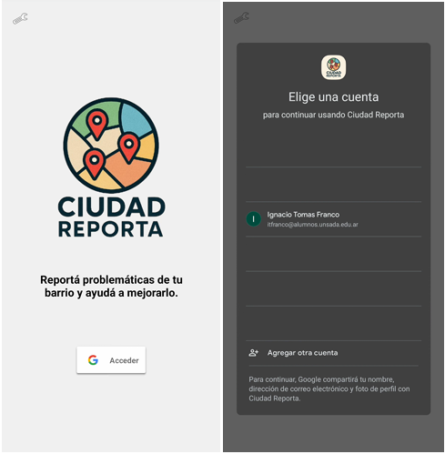
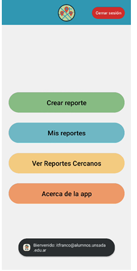
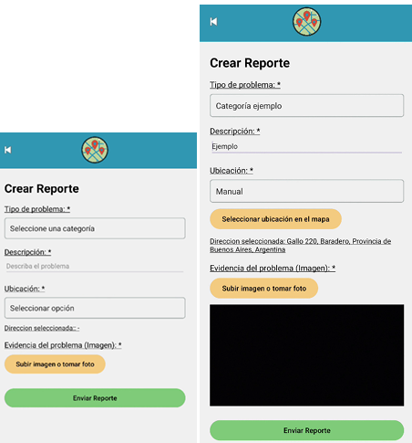
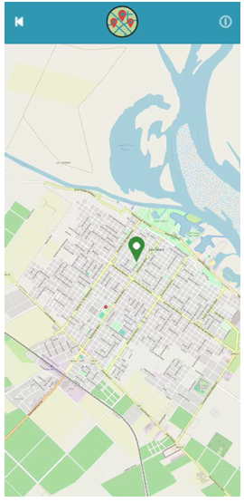
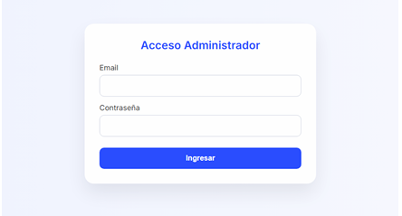
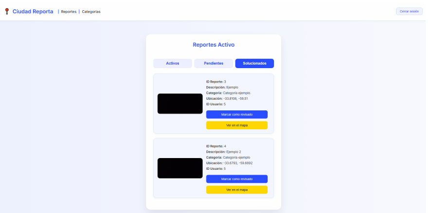
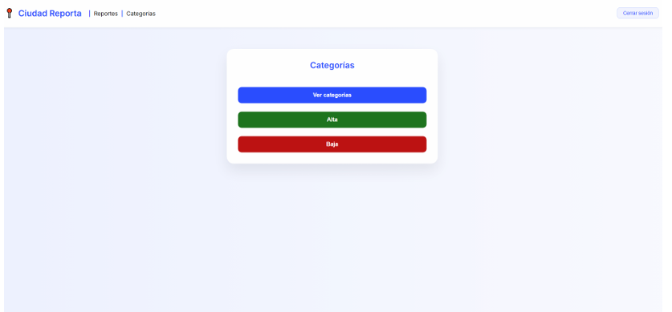
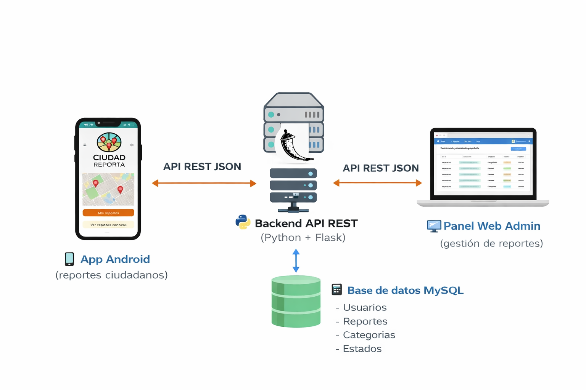

# Ciudad Reporta

Ciudad Reporta es un sistema compuesto por una **aplicación móvil Android** y un **panel web de administración** que permite a los ciudadanos reportar problemas urbanos (basura, luminarias, veredas, etc.) y a los administradores gestionarlos de forma centralizada.

El objetivo del proyecto es **facilitar el registro, seguimiento y resolución de incidencias urbanas** mediante un sistema simple basado en una API REST.

Proyecto desarrollado como trabajo académico universitario.

---

## ¿Qué problema resuelve?

En muchos municipios, los reportes de problemas urbanos se realizan por canales informales o poco organizados (teléfono, redes sociales, reclamos presenciales). Esto genera:

- Falta de seguimiento claro
- Información incompleta (sin ubicación exacta, sin evidencia)
- Dificultad para ordenar prioridades

Ciudad Reporta propone:

- Un **canal digital unificado** para reportar incidencias
- Con **ubicación geográfica**, **imagen** y **descripción**
- Un **panel centralizado** para que el municipio gestione los reportes

---

## Flujo general de funcionamiento

1. El ciudadano crea un reporte desde la app Android (con foto y ubicación).
2. La app envía los datos al backend mediante una API REST (JSON + imagen).
3. El backend guarda la información en la base de datos MySQL.
4. Un administrador ingresa al panel web y:
   - Visualiza reportes por estado
   - Cambia el estado (activo, pendiente, solucionado)
   - Abre la ubicación en Google Maps
5. El usuario puede ver el estado actualizado de sus reportes desde la app.

---

## Funcionalidades principales

### App móvil (Android)
- Login con Google (Firebase Authentication)
- Crear reportes con:
  - Categoría
  - Descripción
  - Imagen
  - Ubicación (GPS o selección manual en mapa)
- Ver “Mis reportes” por estado:
  - Activos
  - Pendientes
  - Solucionados
- Visualizar reportes en el mapa
- Ver reportes cercanos en un radio de 5 km
- Configuración manual de IP del servidor (modo experimental para pruebas)

### Panel web (Administración)
- Login de administradores
- Gestión de reportes por estado:
  - Activos
  - Pendientes
  - Solucionados
- Marcar reportes como solucionados (según reglas del sistema)
- Ver ubicación en Google Maps
- Gestión de categorías:
  - Alta
  - Baja
  - Listado

---

## Tecnologías utilizadas

- Android (Java)
- Python + Flask (API REST)
- MySQL
- HTML / CSS / JavaScript (Panel admin)
- Firebase Authentication
- OSMDroid (mapas en Android)
- Google Maps (panel admin)

---

## Capturas del sistema

### App móvil

**Login**



**Menú principal**



**Crear reporte**



**Mapa de reportes solucionados**



---

### Panel web Admin

**Admin Login**



**Gestión de reportes**



**Gestión de categorías**



---

## Estructura del repositorio
- /Backend -> API REST en Flask (Python)
- /Frontend -> App Android
- /SQL -> Scripts de base de datos
- /docs -> Documentación e imágenes

---

## Instalación y configuración

### 🗄️ Base de datos (MySQL)
1. Crear una base de datos en MySQL.
2. Ejecutar los scripts que se encuentran en /SQL

---

### Backend (API REST)
1. Entrar a la carpeta /Backend
2. Instalar dependencias:

```bash
pip install -r req.txt
```
3. Configurar la conexión a MySQL en el archivo correspondiente (host, user, password, db).
4. Ejecutar el servidor:
```bash
python Ciudad_Reporta.py
```
Backend disponible en:

   - http://localhost:5000 (mismo equipo)
   - http://<IP_DEL_ROUTER>:5000 (para usar desde celular en la red local)

### App Android

Abrir la carpeta /Frontend en Android Studio.

   - Configurar la IP del backend en la app.
   - Ejecutar en un dispositivo físico o emulador.

### Envío de emails

El backend puede configurarse para enviar notificaciones por email usando SMTP.

## Arquitectura del sistema



El sistema está compuesto por tres capas principales:

- Aplicación Android (Java)
- Backend API REST (Flask)
- Panel Web (HTML/CSS/JS)
- Base de datos MySQL

La aplicación móvil y el panel web se comunican con el backend mediante una API REST utilizando JSON.
El backend se encarga de la lógica de negocio, almacenamiento de imágenes y acceso a la base de datos.

